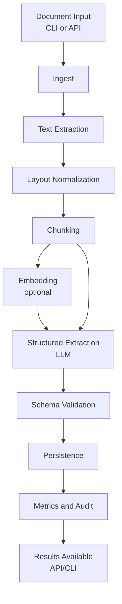
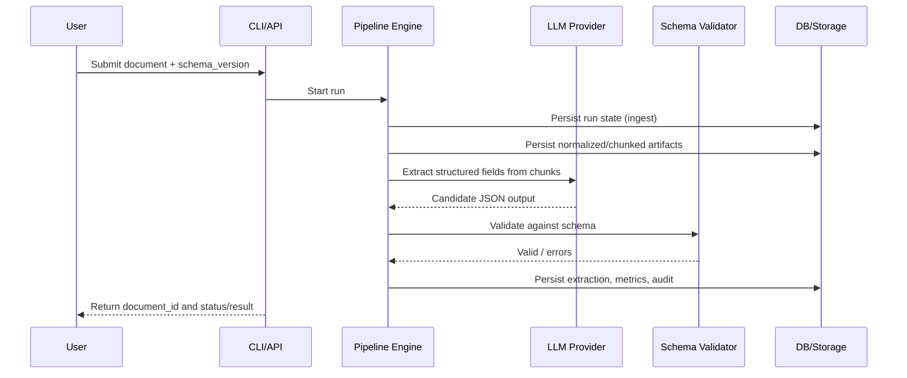
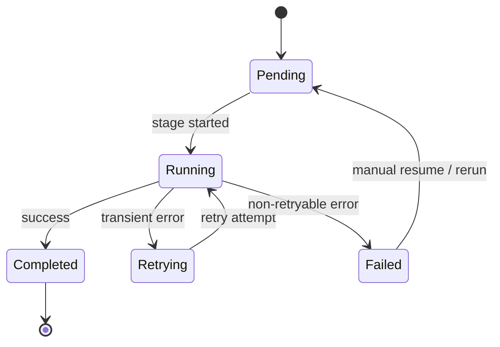

# DocAgentLine

Production-grade headless document extraction pipeline with LLM-driven structured data extraction.

## Architecture

DocAgentLine is a non-interactive, automated pipeline that:
- Ingests documents (PDF, images, text, URLs)
- Extracts and normalizes text and layout
- Chunks content intelligently
- Performs schema-driven structured extraction using LLMs
- Validates outputs against JSON schemas
- Persists all artifacts, metrics, and audit trails
- Exposes operational APIs and CLI

### High-Level Component Diagram (UML)

```mermaid
classDiagram
    class CLI {
 codex/add-uml-and-diagrams-to-readme-9rtnq7
      +submit(source, schema)
      +status(document_id)
      +results(document_id)
      +metrics(document_id)
    }

    class API {
      +submitDocument(file, schemaVersion)
      +getStatus(documentId)
      +getExtractions(documentId)
    }

    class PipelineEngine {
      +run(documentId, schemaVersion)
      +resume(runId)
      +executeStage(stageName)
=======
      +submit()
      +status()
      +results()
      +metrics()
    }

    class API {
      +POST /documents
      +GET /documents/{id}/status
      +GET /documents/{id}/extractions
    }

    class PipelineEngine {
      +run(document_id, schema_version)
      +resume(run_id)
      +execute_stage(stage_name)
main
    }

    class StageRegistry {
      +resolve(stages)
    }

    class LLMProvider {
codex/add-uml-and-diagrams-to-readme-9rtnq7
=======
      <<interface>>
main
      +generate(prompt)
    }

    class EmbeddingProvider {
codex/add-uml-and-diagrams-to-readme-9rtnq7
=======
      <<interface>>
 main
      +embed(text)
    }

    class SchemaValidator {
      +validate(payload, schema)
    }

    class Storage {
codex/add-uml-and-diagrams-to-readme-9rtnq7
      +saveArtifact(path, data)
      +loadArtifact(path)
    }

    class Database {
      +pipelineRuns
      +documentStates
      +extractions
      +metrics
      +auditLog
    }

    CLI --> PipelineEngine : starts
    API --> PipelineEngine : starts
    PipelineEngine --> StageRegistry : resolves
    PipelineEngine --> LLMProvider : calls
    PipelineEngine --> EmbeddingProvider : calls
    PipelineEngine --> SchemaValidator : validates
    PipelineEngine --> Storage : reads and writes
    PipelineEngine --> Database : persists
=======
      +save_artifact()
      +load_artifact()
    }

    class Database {
      +pipeline_runs
      +document_states
      +extractions
      +metrics
      +audit_log
    }

    CLI --> PipelineEngine : triggers
    API --> PipelineEngine : triggers
    PipelineEngine --> StageRegistry : resolves stages
    PipelineEngine --> LLMProvider : structured extraction
    PipelineEngine --> EmbeddingProvider : vector generation
    PipelineEngine --> SchemaValidator : output checks
    PipelineEngine --> Storage : artifacts/prompts/responses
    PipelineEngine --> Database : state + results + telemetry
main
```

### End-to-End Processing Flow



### Sequence Diagram (Request to Result)



### Stage Lifecycle (State-Oriented UML)



## Key Features

- **Resumable**: Pipeline state persisted in SQLite, stages can resume from failure points
- **Idempotent**: Same document + schema version skips already-completed expensive stages
- **Observable**: Structured JSON logging, OpenTelemetry-compatible tracing, full metrics
- **Production-hardened**: Bounded concurrency, backpressure, retry policies, graceful shutdown
- **Schema-driven**: JSON Schema validation, versioned schemas, strict output contracts
- **Provider-agnostic**: Pluggable LLM and embedding providers

## Installation

```bash
pip install -e .
```

## Configuration

All configuration via environment variables:

```bash
# Database
DATABASE_URL=sqlite:///./docagentline.db

# LLM Provider
LLM_PROVIDER=openai
LLM_BASE_URL=https://api.openai.com/v1
LLM_API_KEY=sk-...
LLM_MODEL=gpt-4-turbo-preview
LLM_TIMEOUT=120
LLM_MAX_RETRIES=3

# Embedding Provider
EMBEDDING_PROVIDER=openai
EMBEDDING_BASE_URL=https://api.openai.com/v1
EMBEDDING_API_KEY=sk-...
EMBEDDING_MODEL=text-embedding-3-small
EMBEDDING_BATCH_SIZE=100

# Pipeline
PIPELINE_MAX_CONCURRENT_STAGES=4
PIPELINE_MAX_CONCURRENT_CHUNKS=10
CHUNK_SIZE=1000
CHUNK_OVERLAP=200

# Schema Registry
SCHEMA_REGISTRY_PATH=./schemas

# Storage
STORAGE_PATH=./storage
STORAGE_HASH_RAW_CONTENT=false
STORAGE_PERSIST_PROMPTS=true
STORAGE_PERSIST_RAW_RESPONSES=true

# Security
REDACT_FIELDS=ssn,credit_card,password

# Observability
LOG_LEVEL=INFO
ENABLE_OTEL_TRACING=false
```

## Database Setup

```bash
# Initialize database and run migrations
alembic upgrade head
```

## Usage

### CLI

```bash
# Submit document for processing
docagentline submit --source /path/to/document.pdf --schema invoice_v1

# Check status
docagentline status --document-id <doc_id>

# Retrieve extraction results
docagentline results --document-id <doc_id> --output results.json

# Export metrics
docagentline metrics --document-id <doc_id>
```

### API

```bash
# Start API server
uvicorn docagentline.app.api.main:app --host 0.0.0.0 --port 8000

# Submit document
curl -X POST http://localhost:8000/api/v1/documents \
  -F "file=@document.pdf" \
  -F "schema_version=invoice_v1"

# Check status
curl http://localhost:8000/api/v1/documents/{document_id}/status

# Get results
curl http://localhost:8000/api/v1/documents/{document_id}/extractions
```

## Pipeline Stages

1. **ingest**: Validate and store document
2. **text_extraction**: Extract text from PDF/images using OCR
3. **layout_normalization**: Normalize layout and structure
4. **chunking**: Split into semantic chunks
5. **embedding**: Generate vector embeddings (optional)
6. **structured_extraction**: LLM-driven schema-based extraction
7. **validation**: JSON Schema validation
8. **persistence**: Store validated results
9. **metrics_and_audit**: Record metrics and audit trail

## Schema Registry

Place JSON schemas in `schemas/` directory:

```
schemas/
  invoice_v1.json
  receipt_v2.json
  contract_v1.json
```

Each schema must be valid JSON Schema (draft-07 or later).

## Error Handling

- **TransientExternalError**: Retried with exponential backoff
- **ModelOutputError**: Not retried, logged as model failure
- **SchemaValidationError**: Not retried, stored in validation_errors table
- **PipelineStateError**: Pipeline consistency error, requires investigation
- **StorageError**: Storage operation failure

## Monitoring

All operations emit structured JSON logs with:
- `timestamp`: ISO8601 timestamp
- `level`: Log level
- `run_id`: Pipeline run identifier
- `document_id`: Document identifier
- `stage`: Current pipeline stage
- `correlation_id`: Request correlation ID

Metrics tracked per stage:
- Latency (ms)
- Token usage (input/output)
- Estimated cost (USD)
- Retry attempts
- Failure classification

## Production Deployment

1. Use PostgreSQL instead of SQLite for production scale
2. Enable WAL mode for SQLite if using it
3. Configure appropriate concurrency limits
4. Set up log aggregation (ELK, Datadog, etc.)
5. Enable OpenTelemetry tracing
6. Configure secret management (AWS Secrets Manager, Vault, etc.)
7. Set up monitoring and alerting
8. Configure backup strategy for database and storage

## Testing

```bash
pytest tests/ -v --cov=docagentline
```

## License

Internal enterprise use only.
